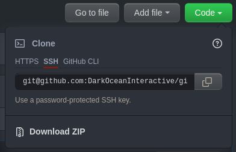
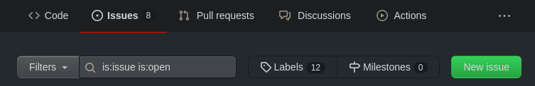
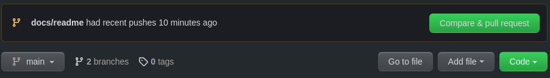
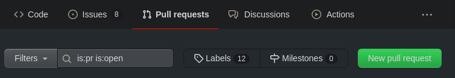
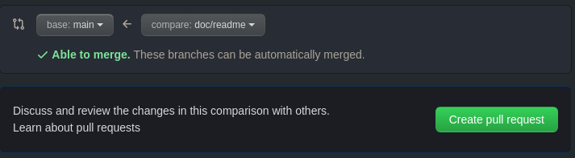
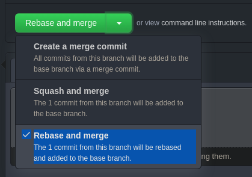

# Git conventions

How to use Git and Github and some rules to follow across the different
projects.

## Table of contents

- [What are Git and GitHub ?](#what-are-git-and-github-)
- [Installation](#installation)
  - [Git via terminal](#git-via-terminal)
    - [Windows and MacOS](#windows-and-macos)
    - [Linux](#linux)
  - [Git via GUI](#git-via-gui)
- [Getting started](#getting-started)
  - [Setting up GitHub](#setting-up-github)
  - [Working with Git and GitHub](#working-with-git-and-github)
    - [Cloning a project](#cloning-a-project)
    - [Committing your changes and pushing them to GitHub](#committing-your-changes-and-pushing-them-to-github)
    - [Receiving online commits locally](#receiving-online-commits-locally)
    - [Wrapping it up](#wrapping-it-up)
  - [Slightly more advanced concepts](#slightly-more-advanced-concepts)
    - [Issues](#issues)
    - [Branches](#branches)
    - [Pull requests (or merge requests)](#pull-requests-or-merge-requests)
- [Workflow and rules to follow](#workflow-and-rules-to-follow)
  - [Workflow](#workflow)
  - [Merging a pull request](#merging-a-pull-request)
  - [Commit conventions](#commit-conventions)
    - [Types](#types)
    - [Scopes](#scopes)
    - [Subject](#subject)
    - [Body](#body)
    - [Examples](#examples)
  - [Branch naming conventions](#branch-naming-convention)
- [Commands memo](#commands-memo)

## What are Git and GitHub ?

Git is version control system. Basically, it's a tool for saving work
(preferably not too large files, such as text, code and sparingly some images
and other assets). Git keeps an history of every changes made to a project. It
is especially useful when bugs are introduced in a software, as it allows to
roll back to previous versions and review changes to see when and how the bug
was introduced. Other than that, it is extremely convenient to work together on
the same project, thanks to a set of features that will be discussed later.

GitHub is a free online platform hosting Git while adding some user features on
top of it. Understand that anything that can be said about Git also applies to
GitHub. Among other things, it provides [Actions](https://github.com/features/actions),
which can be triggered upon various events to perform certain operations. These
can be for instance:

- running tests on the code (checking potential bugs, code format rules, ...)
- performing post-processing on documents (such as transforming a text document
from a format to another)
- ...

## Installation

Git can be used in two main ways: via terminal commands, or via a graphical tool
(GUI), such as [GitKraken](https://www.gitkraken.com/).

This document will mainly discuss Git commands, but feel free to use GitKraken
or any other GUI if you feel more comfortable with it. Either way,
the concepts are the same.

### Git via terminal

#### Windows and MacOS

Git is not installed by default. To install it, follow [the steps described here](https://git-scm.com/downloads).  
Once Git is installed, on Windows, you can open `git bash` from the search bar.
This opens up a terminal in which you can type `git` commands.  
On MacOS, you can open the terminal application and the `git` command should be
available.

#### Linux

[Install the `git` package](https://git-scm.com/download/linux) using the
package manager corresponding to your distribution. The `git` command is then
available in your terminal.

### Git via GUI

There are many GUI clients for Git, but if you need to use one, I would advise
GitKraken, which you can install by following [these steps](https://support.gitkraken.com/how-to-install/).
Or if you only do code, and use an IDE such as Intellij Idea or Visual Studio,
you might want to look for a Git extension / plugin if they are not integrated
by default.

## Getting started

### Setting up GitHub

First of all, to interact with GitHub you need to prove your identity. To avoid
having to enter your email and password everytime you ask GitHub something, you
might want to setup a SSH key authentication. Follow [this guide](https://docs.github.com/en/authentication/connecting-to-github-with-ssh/generating-a-new-ssh-key-and-adding-it-to-the-ssh-agent)
to do so. Once you've created the SSH key following the first few steps, don't
forget to add it to your GitHub account following [the next part of the guide](https://docs.github.com/en/authentication/connecting-to-github-with-ssh/adding-a-new-ssh-key-to-your-github-account).

### Working with Git and GitHub

> As said before, you can follow these steps using a GUI to avoid having to
remember and type the commands. You should find the same steps by the same name
as described below in any GUI.

Git works with `repositories`. A repository contains a collection of various
files of a project. It keeps an history of `commits`, where each commits is a
snapshot, a version of all the files in the repository.

#### Cloning a project

To start off, repositories are stored online (here, on GitHub). However to work
on them you must download them locally on your computer.

This is what we call `cloning` a repository. To do so, copy the SSH link to the
repository as shown below:

<p align="center">
  
</p>

Then clone the repository using this link in the command `git clone <url>`
(replace `<url>` with the actual repository url). This creates a local directory
containing the repository content.

#### Committing your changes and pushing them to GitHub

Understand that any changes then made locally is not synchronized with GitHub
unless you do what it takes.

To save your changes, you need to create a `commit`. First, `add` the files you
want to save to the commit (this step is also called `staging` by some GUIs).
Type the command `git add <path/to/file>` for each file you want to add or
`git add *` to add them all at once.

Once that done, create a commit using the command `git commit -m "<message>"`.
This creates a new commit described by the message you supply. We will see [later](#commit-conventions)
how to write a good message.

At that point, you have a new commit locally. However, it is still not available
on GitHub (and thus, not visible to other users). To synchronize it with GitHub,
type the command `git push origin <branch-name>`. Replace `<branch-name>` with
the current branch name. Branches will be explained [later](#branches). For now,
use `main`.

#### Receiving online commits locally

So far, we only added our work to GitHub. However when other users also add
their work, we need to get it locally. To do so, type the command
`git pull origin <branch-name>`. Same as for the push command, branches will be
explained later, for now, use `main`.  
This will simply download anything new that is on GitHub but not yet in the
local repository.

> ⚠️ Beware:  to avoid overwriting other people's work, you should `pull` every 
ime before `committing` your work. Otherwise, you might end up with an error
when `pushing`, saying that your local repository is not synchronized with the
online one.

#### Wrapping it up

All in all, the basics of Git sums up to these simple steps:

```sh
# cloning a repository
git clone <url>

# adding (staging) modified files to be included in the next commit
git add <path/to/file> # to add a single file or folder
git add * # to add all files

# receiving new changes from the online repository this can be done at
# anytime, but you should at least do it everytime before committing.
git pull origin <branch-name>

# committing the changes
git commit -m "<message>"

# sending the new local commit to GitHub
git pus origin <branch-name>h
```

### Slightly more advanced concepts

There is much more to Git and GitHub, herebelow we will introduce some more
advanced concepts. If they often prove very useful, they are not absolutely
necessary, so maybe don't focus on these too much at the beginning.

#### Issues

Issues describe bugs, wanted features, questions, requests about a repository.
To create an issue, go to the `Issues` tab on the repository's page on GitHub,
and click `New issue`.

<p align="center">
  
</p>

Then you can assign people to the issue, add a description and a label to
categorize your issue (is it a bug report, a request for a feature, a question,
...?). The repository contributors can then discuss the issue here.

#### Branches

Very early, you might encounter `conflicts`. These happend when you worked on
the same files and lines as someone else. It will usually occur while pulling or
pushing, as you try to synchronize your local work with the online repository.

Conflicts can sometime be a pain to solve, and it's often preferable to solve
them one big time rather than at almost every commit we make. One way to do that
is to work with branches. Think of a repository's commits history as a tree's
trunk. The "trunk" is called the main branch. Other git branches are like tree
branches, that leave the trunk at some point in the tree's growth, and
eventually join the trunk back at a latter point.  
When working on a project, a good practice is to create a branch for each
feature you or a sub-team wants to develop.  
To create a branch, type the command `git checkout -b <branch-name>`. Again, we
will see [later](#branch-naming-convention) how to name branches correctly.

Once a branch is created, it is separated from the rest of the repository (the
"trunk" and other branches). That way, when new commits are added to other
branches, they won't interfere with your branch, and you won't have any
conflicts to solve. You can keep working on your feature in peace. Once your
feature is finished, you can merge your branch with the main branch. That is the
only time you might encounter conflicts.

If there are conflicts to merge the branch, they must be resolved manually by
rebasing your branch onto the main branch. To do that, you can use the
`git rebase <branch-name>` command (replace `<branch-name>` by the name of the
branch you want to merge your branch into, usually `main`).

Finally, to switch between branches, you can use the command
`git checkout <branch-name>`, where `<branch-name>` is the name of the branch
you want to switch to.

> ⚠️ Beware:  this can be a very tricky operation, and mistakes can happen very
easily, in the worst cases leading to the loss of your work. Make sure you know
what you're doing or ask someone who does before conducting such an operation.

#### Pull requests (or merge requests)

When merging a branch to the main branch, there might be some important changes.
A good habit is to submit a pull request (also called merge request, which makes
more sense). A pull request is a step before merging a branch into another,
which allows a team to review the branch changes, discuss them, submit requests
for changes before accepting the pull request and actually merging the changes
into the main branch.

It is also a great time for running tests to make sure nothing breaks (new bugs
introduced) when adding those changes.

To submit a pull request, you must push before to your branch. If you just
pushed, GitHub might great you with a popup like this one:

<p align="center">
  
</p>

If it does, then you can simply click the `Compare & pull request` button to
create the pull request.

Otherwise, go to the `Pull requests` tab on the repository's page on GitHub,
and click `New pull request`.

<p align="center">
  
</p>

Make sure the base branch is the one you want to merge changes into, and the
compare branch is your branch, then click `Create pull request`.

<p align="center">
  
</p>

Then you can assign people to review your pull request, and add a description
of the content of your branch.

## Workflow and rules to follow

You now know nearly everything you need to know about Git, it's time to get to
know some good practices it would be nice to follow for consistency over the
project and to avoid common problems.

### Workflow

**Nothing should be committed directly to the main branch.**

When you want to apply changes, you should:
- Create a github `issue` that describes what the changes are about (if you
use Github Projects (TO-DO lists), this also helps keeping track of the TO-DOs)
- Create a `dedicated branch` for this issue, following the branch naming
convention below
- Commit your work to this branch, following the commit convention below
- Once you are done, create a `pull request` and link to the issue:
   - Assign yourself to the pull request
   - Assign reviewers
- After the pull request has been reviewed, it can be merged.

### Merging a pull request

When merging a pull request, the default behaviour creates a new commit with a
message like `Merge pull request #<id> from <username>/<branch-name>`.  
If that may help keep track of merges in the history, I personally prefer not
including this commit, as it adds nothing useful to the rest of the branch's
commits and polutes the history with a [non-conventional commit message](#commit-conventions).

For that reason, when merging pull requests, please make sure to select the
`Rebase and merge` option instead of the `Create a merge commit` option. This
will simply add the branch's commits to the target branch (main).

<p align="center">
  
</p>

### Commit conventions

Each commit message should follow the following format:

<pre>
<b><a href="#types">&lt;type&gt;</a></b></font>(<b><a href="#scopes">&lt;optional scope&gt;</a></b>): <b><a href="#subject">&lt;subject&gt;</a></b>
<sub>empty separator line</sub>
<b><a href="#body">&lt;optional body&gt;</a></b>
</pre>

> ⚠️ The length of the first line  of the commit message (type + scope +
subject) should not exceed 80 characters in length. Otherwise, it might cause
readability issues as GitHub will only display 80 characters in the commits
history. Make the subject really short, and add details in the body

#### Types

Use one of these in the `<type>` field:

- `feat`: changes that add a new feature
- `fix`: changes that fix a bug
- `hotfix`: changes that fix a critical bug (should be merged to the main
branch urgently)
- `refactor`: changes that rewrite/restructure your code, but does not change
any behaviour
- `perf`: changes that improve performance
- `style`: changes that do not affect the meaning (white-space, formatting,
missing semi-colons, etc)
- `test`: changes that add missing tests or correcting existing tests
- `docs`: changes in documentation only (README, wiki, comments, ...)
- `build`: changes that affect the build system or external dependencies
- `ci`: changes to the CI (Github Actions)

#### Scopes

The `scope` provides additional contextual information.

- Is an **optional** part of the format, such as which sub-part of the project
was changed.
- It should be only one word if possible (dashes allowed)

#### Subject

The `subject` contains a succinct description of the change.

- Is a **mandatory** part of the format
- Use the imperative, present tense: "change" not "changed" nor "changes"
- Don't capitalize the first letter
- No dot (.) at the end

#### Body

The `body` can include additional information on the commit content or
motivations for the changes. It can also list, in the same format as the same
line, other, smaller changes (fixes, docs, ...) included in this commit.

- Is an **optional** part of the format
- Use the imperative, present tense: "change" not "changed" nor "changes"
- This is the place to mention issue identifiers and their relations (write
`Closes #<issue-id>` on a new line to close the corresponding issue or pull
request)

#### Examples

```
feat(physics): collision detection using K-d tree during broad phase
```

```
fix: camera no longer gets stuck on door frames

The error occurred because of <reasons>.
doc: document the fix in the changelog
```

```
style: remove empty line
```

### Branch naming convention

As explained before, to avoid common problems, you should create a branch for
every task you plan to undertake. This includes new features, documentation,
fixes, ...

Try to give your branch a descriptive name by following the format below:

<pre>
<b><a href="#types">&lt;type&gt;</a></b></font>/<b><a href="#subject">&lt;subject&gt;</a></b>
</pre>

`type`: same as for the commit messages (see above)  
`subject`: short summary (usualy up to 5 words) of the changes that are being
applied.

> i.e.: `fix/camera-door-frames`

## Commands memo

To sum things up, here's a complete list of the commands discussed in this
document. Of course, there is a lot more to Git and GitHub, but to keep this
quite simple, not everything was discussed. Especially troubleshooting which can
be very tedious, and unless you know what you're doing, you should often ask
someone who can help troubleshoot.

| Command                         | Description                                                                                                               |
| ------------------------------- | ------------------------------------------------------------------------------------------------------------------------- |
| `git clone <url>`               | [clone a repository](#cloning-a-project)                                                                                  |
| `git add <path/to/file>`        | [add (stage) a single file or folder to be saved in the next commit](#committing-your-changes-and-pushing-them-to-github) |
| `git add *`                     | [add (stage) all files to be saved in the next commit](#committing-your-changes-and-pushing-them-to-github)               |
| `git commit -m "<message>"`     | [create a new commit](#committing-your-changes-and-pushing-them-to-github)                                                |
| `git push origin <branch-name>` | [add local commits to the online repository branch](#committing-your-changes-and-pushing-them-to-github)                         |
| `git pull origin <branch-name>` | [getting new commits from the online repository branch](#receiving-online-commits-locally)                                       |
| `git checkout -b <branch-name>` | [create a new branch](#branches)                                                                                          |
| `git rebase <branch-name>`      | [rebase the current branch onto another branch (usually `main`)](#branches)                                               |
| `git checkout <branch-name>`    | [switch to another branch](#branches)                                                                                     |
